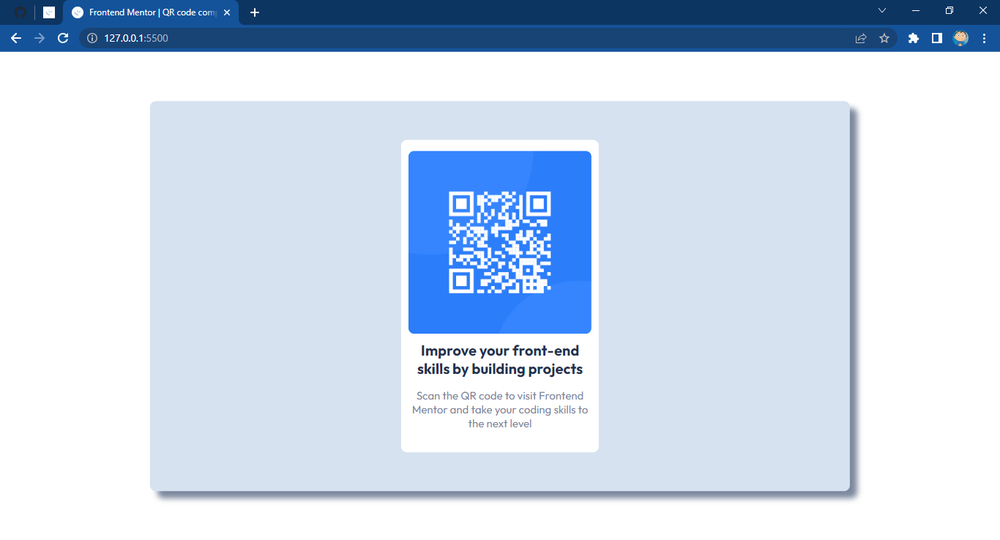

# Frontend Mentor - QR code component solution by Er-Carl Abban

This is a solution to the [QR code component challenge on Frontend Mentor](https://www.frontendmentor.io/challenges/qr-code-component-iux_sIO_H).

## Table of contents

- [Overview](#overview)
  - [Screenshot](#screenshot)
- [My process](#my-process)
  - [Built with](#built-with)
  - [What I learned](#what-i-learned)
  - [Continued development](#continued-development)
  - [Useful resources](#useful-resources)
- [Author](#author)

## Overview
### Screenshot


### Links

- Solution URL: [KharlAbban](https://github.com/frontendmentor-qrcode-soln)
- Live Site URL: [Github Pages](https://kharlabban.github.io/frontendmentor-qrcode-soln/)

## My process

### Built with

- Semantic HTML5 markup
- CSS custom properties
- Flexbox
### What I learned

Since this is my first challenge, I spent a bit of time to really understand the requirements. I was able to refresh my memory on CSS quite a lot.

To see how you can add code snippets, see below:

```html
<div class="center">Some HTML code I'm proud of</div>
```
```css
.center {
  --light-gray: hsl(212, 45%, 89%);
  --grayish-blue: hsl(220, 15%, 55%);
  background: var(--light-gray);
  width: 50%;
  height: 50%;
  margin: auto;
  position: absolute;
  text-align: center;
  top: 50%;
  left: 50%;
  transform: translate(-50%, -50%);
  border-radius: 8px;
  display: flex;
  justify-content: center;
  align-items: center;
  box-shadow: 10px 10px 8px var(--grayish-blue);
}
```
### Continued development

I plan to focus more on relative values when setting position elements and sizes. Also included in my plans are to clean up the code, simplify it and modify the media section of the CSS.

### Useful resources

- [w3schools](https://www.w3schools.com) - This helped me to refresh my memory on overlooked CSS tips. Plus lots of helpful examples
## Author

- Frontend Mentor - [@KharlAbban](https://www.frontendmentor.io/profile/KharlAbban)
- Github - [KharlAbban](https://www.github.com/KharlAbban)
- LinkedIn - [KharlAbban](https://www.linkedin.com/in/er-carl-abban-623817271/)